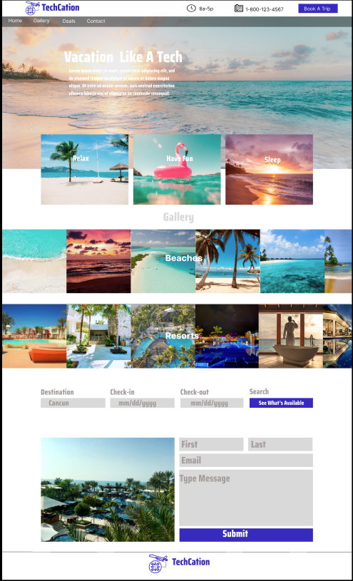

# TechCation

## Deployed Website
[TechCation](https://foodies2.vercel.app/)  
Initial Deployment Date: March 24, 2023

## Description
This was a get back to basics approach to making a landing page. I started with researching different sites to model the landing page. I found (Clint)code commerce channel on youtube and decided to base it on that style. I then created a prototype for the landing page using figma. I then coded the landing page. I made some  changes to the landing page from the prototype and it looks more appealing. I have a better understanding of Next.js and Tailwind and look forward to learn more about these technologies.

## Tech Used
- NextJS
- Tailwind

## Prototype

## Questions
Feel free to contact any contributing developer with suggestions for improvements, questions or concerns.
 
[Email: Aaron Anglin](mailto:aaron.anglin101@gmail.com)

## Contributor
<td align="center"><a href="https://github.com/aanglin"> <b>Aaron Anglin</b></a></td>